# Bellabeat Case Study with R

This repository contains my work for the Google Analytics Capstone Project

## Smart Device Analysis- How Well Can a Technology Company Play It Smart?
Data was downloaded from a public domain: https://www.kaggle.com/datasets/arashnic/fitbit

### About the Company

   Urška Sršen and Sando Mur founded Bellabeat, a high-tech company that manufactures health-focused smart products.
Sršen used her background as an artist to develop beautifully designed technology that informs and inspires women around
the world. Collecting data on activity, sleep, stress, and reproductive health has allowed Bellabeat to empower women with
knowledge about their own health and habits. Since it was founded in 2013, Bellabeat has grown rapidly and quickly
positioned itself as a tech-driven wellness company for women

### The Ask

##### Key Stakeholders
* Urška Sršen- cofounder and Chief Creative Officer
* Sando Mur- Mathematician and Bellabeat’s cofounder
* Bellabeat marketing analytics team

##### Business Task: Identify potential opportunities for growth and recommendations for the Bellabeat marketing strategy improvement based on trends in smart device usage.

##### Questions for the analysis:
1. What are some trends in smart device usage?
2. How could these trends apply to Bellabeat customers?
3. How could these trends help influence Bellabeat marketing strategy?

### Prepare
The data set contains personal fitness tracker from thirty fitbit users. Thirty-three eligible Fitbit users consented to the submission of
personal tracker data, including minute-level output for physical activity, heart rate, and sleep monitoring. It includes
information about daily activity, steps, and heart rate that can be used to explore users’ habits.

##### Dataset:
The data source used for our case study is FitBit Fitness Tracker Data. This dataset is stored in Kaggle and was made available through Mobius.

##### Install packages and libraries 
> library(tidyverse)
> library((lubridate)
> library(ggplot2)

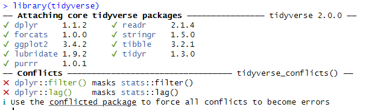

##### Read Files
> activity<-read_csv("/cloud/project/Fitabase Data/dailyActivity_merged.csv")
> hrIntensities<-read_csv("hourlyIntensities_merged.csv")
> calories <- read_csv("dailyCalories_merged.csv")
> intensity <- read_csv("dailyIntensities_merged.csv")
> steps <- read_csv("dailySteps_merged.csv")

##### Formatting date and time from the files read
Split Time and Date

separate date
> calories$Date <- as.Date(calories$ActivityHour) 

separate time
>  calories$ActivityHour=as.POSIXct(calories$ActivityHour, format="%m/%d/%Y %I:%M:%S %p", tz=Sys.timezone())
>  calories$time <- format(calories$ActivityHour, format = "%H:%M:%S")

> hrRate$Date <- as.Date(hrRate$Time)
> hrRate$Time=as.POSIXct(hrRate$Time, format="%m/%d/%Y %I:%M:%S %p", tz=Sys.timezone())
> hrRate$Time <- format(hrRate$Time, format = "%H:%M:%S")

separate day
> hrIntensities$ActivityHour=as.POSIXct(hrIntensities$ActivityHour, format="%m/%d/%Y %I:%M:%S %p", tz=Sys.timezone())
> hrIntensities$time <- format(hrIntensities$ActivityHour, format = "%H:%M:%S") 
> hrIntensities$Date <- format(hrIntensities$ActivityHour, format = "%m/%d/%y")

### Explore and Analyze Data

> n_distinct(activity$Id)  
> n_distinct(calories$Id)  
> n_distinct(intensity$Id)  
> n_distinct(steps$Id)  
> n_distinct(hrIntensities$Id)
>
> [1] 33  
> [1] 33  
> [1] 33  
> [1] 33  
> [1] 33  

##### Summary Stats

> activity %>%  
> +select(TotalSteps, TotalDistance, Calories) %>%  
> +summary()
>
>activity %>%  
> +select(SedentaryMinutes,LightlyActiveMinutes,FairlyActiveMinutes,VeryActiveMinutes) %>%  
> +summary()
>
> activity %>%  
> +select(SedentaryActiveDistance,LightActiveDistance,ModeratelyActiveDistance,VeryActiveDistance) %>%  
> +summary()
>
> activity %>%  
> +select(Calories) %>%  
> +summary()
>
> activity %>%  
> +select(TotalMinutesAsleep) %>%  
> +summary()
>
> weight %>%
> +select(WeightPounds,BMI) %>%
< +summary()
>
> mets %>%  
< +select(METs) %>%  
> +summary()
>
> hrRate %>%  
> +select(Value) %>%  #value=heart rate  
> +summary()
>

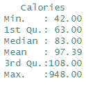  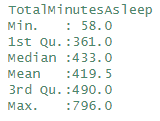  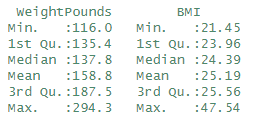

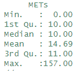  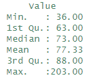   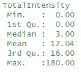

  

##### Discovery from summaries

* Active Minutes: individuals were mostly sedentary at 991.2
* Steps: average was 7638; 10.000 steps per day are recommended
* Distance: individuals on average were mostly lightly active at 3.341 miles
* Calories: average was 97.39; 180 calories are recommended per 1 hr walk @3.5 mph
* Sleep: average was 419 minutes or 6.983 hours; 7-8 hours are recommended
* BMI: average was slightly higher at 25.9; a BMI 18.5 to 25 is recommended
* METS: average METS was 14.69; a MET of 9-11 is considered good and  a MET >= 12 is excellent

*Citations:
[Steps per day- NIH](https://www.nih.gov/news-events/nih-research-matters/number-steps-day-more-important-step-intensity#:~:text=Taking%204%2C000%20or%20fewer%20steps,10%2C000%20steps%20are%20taken%20daily) or [Daily Steps- CDC](https://www.cdc.gov/diabetes/prevention/pdf/postcurriculum_session8.pdf)
[Sleep per day](https://www.cdc.gov/niosh/work-hour-training-for-nurses/longhours/mod2/08.html#:~:text=Most%20adults%20need%20about%207,long%20enough%20for%20the%20individual)
[BMI](https://www.cdc.gov/healthyweight/assessing/bmi/adult_bmi/english_bmi_calculator/bmi_calculator.html)
[Average METS](https://www.ncbi.nlm.nih.gov/pmc/articles/PMC6078558/#:~:text=Exercise%20capacity%20is%20based%20on,METS%20or%20more%20is%20excellent)
[Sleeping HR](https://www.sleepfoundation.org/physical-health/sleeping-heart-rat)

## Visualizations
*Date vs. Average Steps*
> stepsbyDate<- activity %>% 
> +group_by(ActivityDate) %>%
> +drop_na() %>% -->
> +summarize(mean_totalSteps = mean(TotalSteps))
Plot
>ggplot(data=stepsbyDate, aes(x=ActivityDate, y=mean_totalSteps)) + geom_histogram(stat = "identity", fill="dodgerblue4")+
> +theme(axis.text.x = element_text(angle = 90)) +
> +labs(title="Average Total Steps vs. Dates")
>
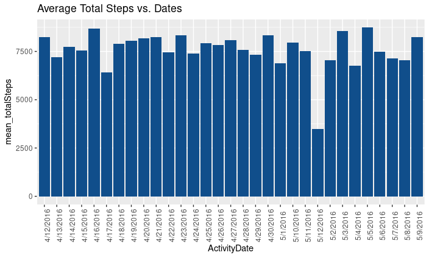

Findings:
Plot indicates users are below the recommended 10,000 steps averaging 7,638 steps per day.

*Date vs. Average Calories*
> CalByDate<-activity %>%
> +group_by(ActivityDate) %>%
> +drop_na() %>%
> +summarize(mean_totalCalories = mean(Calories))
Plot
> ggplot(data=CalByDate, aes(x=ActivityDate, y=mean_totalCalories)) + geom_histogram(stat = "identity", fill="dodgerblue3")+
> +theme(axis.text.x = element_text(angle = 90)) +
> +labs(title="Average Calories vs. Dates")
>
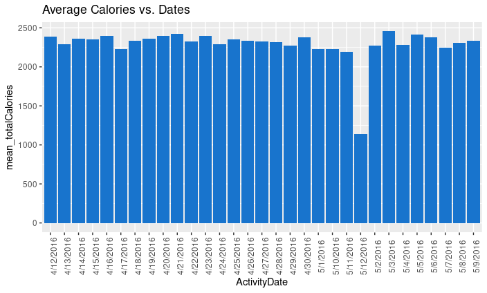

Findings:
Assuming 2000 calories of consumption per day ( actual values depend on height, weight, age, and activity level), to maintain weight 2000 calories per day would also need to be burned to maintain weight. Based on the data, the average burned calories per day is 2,304.

*Intensity vs. Time*
>IntensitybyTime<-hrIntensities %>%
> +group_by(time) %>%
> +drop_na() %>%
> +summarize(mean_Intensity = mean(TotalIntensity))
Plot
*Total Steps vs. Calories*
> ggplot(data=activity, aes(x=TotalSteps, y=Calories)) +
> +geom_point() + geom_smooth() +
> +labs(title="Total Steps vs. Calories")
>
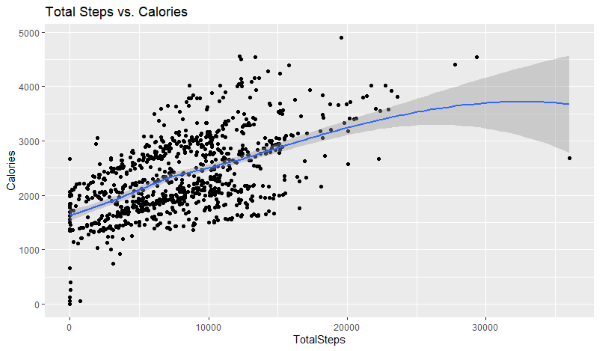

*Intensity vs. Time
> ggplot(data=IntensitybyTime, aes(x=Time_Intensity, y=mean_Intensity)) + geom_histogram(stat = "identity", fill="dodgerblue2")+
> +theme(axis.text.x = element_text(angle = 90)) +
> +labs(title="Average Intensity vs. Time") 
>
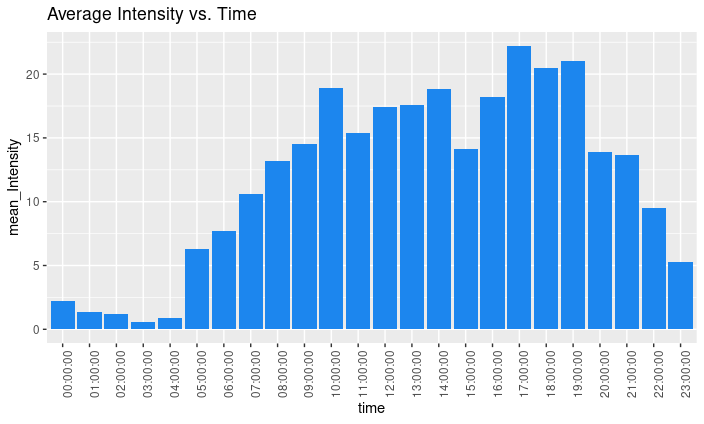

Findings:
Most active hours are during work hours of 10 am to 2pm. There is a decline in intensity at 3 pm then increases between 4 pm to 7 pm; at which the highest intensity is between 5p and 7 pm within 24 hours. Granted Sedentary Minutes is the highest, there was an average of 13.56 fairly active minutes and 21.16 very active minutes. An average of 2304 calories per day, the women have met the number of calories to maintain or lose weight and have met the daily recommended minutes of intensity (exercise) of 30 minutes.

*Sedentary Minutes vs. Calories
> ggplot(data=activity, aes(x=SedentaryMinutes, y=Calories)) +
> +geom_point() + geom_smooth() +
> +labs(title="Sedentary Minutes vs. Calories")
>
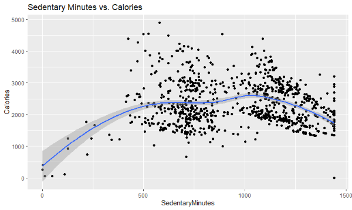

*Very Active Minutes vs Calories
> 
> ggplot(data=activity, aes(x=VeryActiveMinutes, y=Calories)) +
> +geom_point() + geom_smooth() +
> +labs(title="Very Active Minutes vs. Calories")
> 
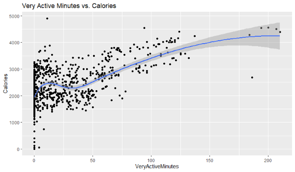

Findings:
Sedentary Minutes vs. Calories
The average sedentary 991.2 minutes are consistent with an 8 hour work day plus 6.98 average hours of sleep. The rate of change in calories in comparison to Sedentary minutes is small.

Very Active Minutes vs Calories
The rate of change of Calories for Very Active minutes is more in comparison to calories for Sedentary Minutes. After 30 minutes of Very Active activity there is a moderate increase in Calories burned. 
 
## Recommendations

Based on the data the sedentary minutes are consistent with women working an 8 hour job, receiving about 7 hours of sleep. There is increase in activity after hours. Growth for the company may include:
* alerts to move during working hours decreasing sedentary minutes and increasing burned calorie. 
* Taking a break to walk, hydrate, and meditate. Introduce personal goals whether to maintain weight or lose weight. 
* Develop alerts that support the weight goals. 
* Consistent monitoring of the goal and alerting whether on track for the day.
* Promote longer sleep periods with bedtime notifications.
* Encourage workout notifications and badges with evening and weekend workouts.
* Offer community shares celebrating daily/monthly goals.
* Offer the ability to challenge/competitions with others such as steps, calories, floors climbed, quality sleep score, and water intake.
* Promote the Spring water bottle to efficienly/conveniently track water intake that synchronizes with the Bellabeat app.
